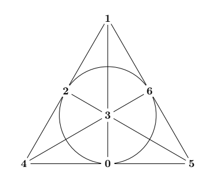

# acoustic_modem
ACOUSTIC FINITE GEOMETRY TRANSPORT LAYER (AFGTL)
================================================

An acoustic covert channel modem built using projective planes, Steiner
systems, and block codes. Transmits data through air-gapped systems using
ultrasonic FSK modulation with selectable error-correcting codes.


DEPENDENCIES
------------

Python 3.9+
numpy
scipy


USAGE
-----

Transmit a string:

    python acoustic_modem_aux.py tx -q 5 --ecc sqs16 "HELLO" -o transmit.wav

Transmit a file:

    python acoustic_modem_aux.py tx -q 5 --ecc sqs16 -f payload.txt -o transmit.wav

Receive via microphone:

    python acoustic_modem_aux.py rx -q 5 --ecc sqs16 -i MIC -d 30

Receive via pre-recorded WAV file:

    python acoustic_modem_aux.py rx -q 5 --ecc sqs16 -i captured.wav


## OPTIONS

* **`-q`**
    Singer plane order (2, 3, 5, or 7). Default: 5

* **`--ecc`**
    Error-correcting code. Choices:
    * `hamming` [7,4,3] (baseline)
    * `selfdual` [8,4,4] (detects double errors)
    * `qr` [7,3,4] (strong distance for rate)
    * `pg23` [13,9,3] (high rate, projective plane)
    * `sts9` [9,5,3] (compact, affine design)
    * `sts15` [15,11,3] (high density, PG(3,2))
    * `sqs16` [16,11,4] (flagship, best overall balance). 
    *Default: sqs16*

* **`--extended`**
    Use 16-bit header for payloads larger than 255 bytes

* **`-o`**
    Output WAV filename (tx only). Default: transmit.wav

* **`-i`**
    Input source (rx only). "MIC" for live recording, or a WAV path

* **`-d`**
    Recording duration in seconds (rx only). Default: 25


QUICK TEST
----------

Open two terminals on the same machine, or use two devices. On the
transmitter:

    python acoustic_modem_aux.py tx -q 5 --ecc hamming "TEST MESSAGE"

Play the resulting transmit.wav through speakers. On the receiver:

    python acoustic_modem_aux.py rx -q 5 --ecc hamming -i MIC -d 30

Press Enter, then immediately play the audio. A successful decode prints
the message to stdout with a CRC32 confirmation to stderr.


HOW IT WORKS
------------

The modem uses a Singer difference set to construct a preamble with a
sharp autocorrelation peak. The receiver slides a local copy of the
preamble across incoming audio and locks onto the correlation spike.

Payload data is protected by a selectable error-correcting code derived
from a t-design or finite geometry. Each code lives in its own engine
class with a uniform string_to_bits() / bits_to_string() interface.

Bits are modulated with 4-ary FSK at 17-18.5 kHz. A PI tracking loop
corrects for clock drift between the transmitter and receiver sound
cards. Encryption is a simple XOR cipher with a repeating key. Integrity
is verified with CRC32.


HARDWARE NOTES
--------------

Most laptop speakers and smartphone microphones handle 17-18.5 kHz
without issue. The signal is inaudible to most adults. For best results
at range, keep the transmitter volume high but not clipping, and place
the receiver microphone with a clear line of sight to the speaker.


PORTABLE DEPLOYMENT
-------------------

To run on a locked-down Windows workstation that blocks installers:

    python -m venv --copies portable_env
    portable_env/bin/pip install numpy scipy
    cp acoustic_modem_aux.py portable_env/
    zip -9 -r portable.zip portable_env/

Transfer the zip (split into pieces if needed due to email limits) and
extract on the target machine. Run with:

    .\python acoustic_modem_aux.py tx -q 5 --ecc sqs16 "HELLO"
    
<br>
<br>
    
THE STORY BEHIND ITS CONSTRUCTION: Covert Data Exfiltration in Hospitals
===========================================================================

# Covert Data Exfiltration in Hospitals
**Author:** Jerod Michel

## 0. Abstract

How knowing a few simple combinatorial principles makes the task of building an acoustic modem quite easy; and how testing its use for covert data exfiltration on secure nodes around a hospital went.

## 1. Introduction

I work in a hospital. Most employees here work on secure workstations where all normal connections are monitored, or blocked, for reasons including to protect patient data, credentials, network maps, etc. The "if one was so inclined"-voice inside my head, combined with an occasional urge to reminisce about my research days, led me to try to get some of the data off these devices with no one being the wiser.

I was in academia all my life--until recently. I had a good decade-long run doing research in the areas of coding theory, combinatorics and cryptography and, over the years, also became moderately familiar with Linux and a few staple languages like Bash, Lisp and Python. Now I enjoy a job in a hospital that doesn't come with seven hours of homework every night and, when I clock out, it's my own time.

There are a couple of combinatorial objects--namely, difference sets, designs, and (error-correcting) codes--having a very basic knowledge of which makes coding an acoustic modem to run in a noisy room fairly easy. Since there are safeguards on these nodes meant to block users from installing anything (or even running executables in many cases), it made sense to do this by generating sound files with whatever data was to be exfiltrated, from inside an embeddable python environment, and then running the sound files on whichever media player was on the node. This is done while running the receiver function of the same modem on another device (phone, raspberry pi, personal laptop, etc.) to capture and decode the signal. Note that, in most hospitals, users have access to speakers and can play sound files as employees use these workstations for things like training modules, virtual patient consultations, etc.

Having begun this experiment in python, and finding it convenient for operating on the above-mentioned combinatorial objects, I went ahead and added some encryption and error-correcting functionality, as well as several other user options, and practical command-line interface. The finished modem can be found at [github.com/jerodmichel/acoustic_modem](https://github.com/jerodmichel/acoustic_modem).

## 2. Prior Works

Much of acoustic air-gap exfiltration over the last decade has been led by the work of Mordechai Guri et al. at Ben-Gurion University. Early covert acoustic channels relied heavily on standard PC speakers, which secure facilities easily mitigate by unplugging them or disabling audio drivers. Recent innovations were to treat mechanical components as crude speakers. One such direction was to modulate rotational speed of CPU and chassis cooling fans to generate specific acoustic waveforms, allowing data exfiltration from entirely speakerless systems [5]. Another was to programmatically force the hard disk drive's actuator arm to execute specific 'seek' operations, whereby attackers could generate acoustic emissions at targeted frequencies [6]. More sophisticated still is the manipulation of the internal switching frequency of the PSU to force its capacitors and transformers to emit tones, effectively turning the PSU into an out-of-band speaker operating in the 0-24kHz range [4].

Modulating fan blades is slow and drowns in ambient noise. Hard drive seek acoustics suffer from severe jitter. PSU whine is a raw, noisy pipe past a few meters.

For acoustic modems with standard speakers--the lineage our modem belongs to--the Fraunhofer Mesh Network [8] was a kind of grandfather of acoustic exfiltration. Here it was shown that standard laptop speakers and mics could create an inaudible, ultrasonic mesh network for bridging air-gaps. They used a modified version of the adaptive differential pulse-code modulation (AADPCM) used in underwater acoustics.

Using ADPCM is practical when working inside a noisy room with potentially high multipath fading, but it ran at around 20 bits per second. The reader will see that with some simple error-correcting schemes the protocol can survive the chaotic ambient noise of an emergency room, and at better rates.

It's also worth mentioning that once acoustic channels were established as a real threat (recall badBIOS), Guri et al. responded with MOSQUITO [7], a manipulation of the Realtek audio chipset which reversed the impedance of the audio jack, thereby turning a passive desktop speaker (or headphone) into a microphone and allowing for two-way communication.

--[ 3. Difference Sets, Correlation and the Preamble

Let $\mathbb{Z}_7 = \{0, 1, \dots, 6\}$ be the set of integers modulo $7$. Consider the subset $\{1, 2, 4\}$ of $\mathbb{Z}_7$. Notice by taking all possible differences modulo $7$ between distinct pairs from this subset, we get back each nonzero member of $\mathbb{Z}_7$ exactly once:

$$2 - 1 \pmod{7} = 1 \quad 1 - 2 \pmod{7} = 6 \quad 4 - 1 \pmod{7} = 3$$

$$1 - 4 \pmod{7} = 4 \quad 4 - 2 \pmod{7} = 2 \quad 2 - 4 \pmod{7} = 5$$

and we get the identity, $0 \pmod{7}$, exactly $3$ times:

$$1 - 1 \pmod{7} = 0 \quad 2 - 2 \pmod{7} = 0 \quad 4 - 4 \pmod{7} = 0$$
       
More generally, if $D$ is a subset of $\mathbb{Z}_n$ (integers modulo $n$) containing $k$ elements, and every non-zero member of $\mathbb{Z}_n$ can be expressed as a difference $d_1 - d_2$, where $d_1, d_2$ are contained in $D$, exactly $\lambda$ times, then $D$ is called an $(n, k, \lambda)$ difference set. For an introduction to difference sets see [11] and [12].

This property makes difference sets convenient for signal processing. If we convert a difference set $D$ into a binary sequence of length $n$ (by placing a $1$ at each index in $D$ and a $0$ elsewhere), we obtain a sequence $s$. Now consider what happens when we correlate $s$ with a shifted copy of itself. Signal processing with sequences and their correlation is covered in depth in [3].

Mathematically, cross-correlation is a sliding dot product--a measure of similarity between two signals as a function of the time with lag applied to one of them. To calculate it, take a known template sequence, overlay it onto an incoming data stream, and shift it by one position at a time. At each shift, overlapping values are multiplied and the result is the sum over these products:

For a received signal $r$ and a known template $t$, at each lag position $j$, the sum of element-wise products is:

$$ \text{corr}[j] = \sum (r[i] \cdot t[i - j]) $$

where the sum runs over all samples $i$ where both signals overlap. We can use
NumPy's `correlate()` as it is done in optimized C:

```python
correlation = np.correlate(received, template, mode='valid')
peak_idx = np.argmax(np.abs(correlation))
strength = np.abs(correlation[peak_idx]) / np.sum(template**2)
```

Here, "template" is a local copy of the preamble--the same binary sequence
the transmitter sends, modulated into audio using the same FSK frequencies
the receiver expects. The receiver generates this template ahead of time and
slides it along the incoming signal, computing the correlation at each
position.

When the template slides past the point where the real preamble sits in the
received audio, the two align and the correlation spikes. The value at that
peak is $k$, the number of ones in the difference set. At every other
lag--when the template sits over noise, silence, or data symbols--the
correlation is exactly $\lambda$. For a Singer set with $\lambda = 1$, this means
the peak is $q+1$ against a noise floor of $1$, a contrast ratio that is easy to
detect even in a noisy room.

Singer showed that for any prime power $q$, there exists an $(n, k, \lambda)$
difference set in $\mathbb{Z}_n$ with parameters:

$$
\begin{aligned}
n &= q^2 + q + 1 \\
k &= q + 1 \\
\lambda &= 1
\end{aligned}
$$

For $q = 2, 3, 5$, and $7$, the base sets are shown below. The function
`get_singer_sequence` expands a base set into a full binary preamble of length
$n$:

```python
def get_singer_sequence(q):
    sets = {
        2: [0, 1, 3],
        3: [0, 1, 3, 9],
        5: [0, 1, 3, 8, 12, 18],
        7: [0, 1, 3, 13, 32, 36, 43, 52]
    }
    v = q**2 + q + 1
    seq = [0] * v
    base_set = sets.get(q)
    if base_set:
        for pos in base_set:
            seq[pos % v] = 1
    return seq
```

The receiver knows the preamble for the chosen $q$ in advance. It also knows
the two frequencies assigned to $0$ and $1$ bits in the preamble (the lowest and
highest of our four carrier tones--more on this in Section 5). The preamble
is modulated and prepended to every transmission. On the receiving end, the
entire synchronization problem reduces to running a sliding
cross-correlation and looking for the spike.

--[ 4. t-Designs, EC Codes, and Encoding/Decoding

Consider the following subsets of the set $\mathbb{Z}_7 = \{0, 1, \dots, 6\}$:

$$ \{1, 2, 4\} \quad \{2, 3, 5\} \quad \{3, 4, 6\} \quad \{0, 4, 5\} \quad \{1, 5, 6\} \quad \{0, 2, 6\} \quad \{0, 1, 3\} $$

Notice that any pair of points from $\mathbb{Z}_7$ appears in exactly one of the above subsets, and any two of the subsets intersect in exactly one point.

<p align="center">
  
</p>

This simple geometric structure, called the Fano plane, is a nice pivot. Notice it is a special case of the following more general object.

Let $V = \{0, 1, \dots, v\}$ be a set of $v$ points, and $B = [B_1, B_2, \dots, B_n]$ be a collection of subsets of $V$, called blocks, satisfying:

1) each block contains exactly $k$ points, and
2) any $t$ points of $V$ are contained in exactly $\lambda$ blocks.

Then the pair $(V, B)$ is called a $t-(v, k, \lambda)$ design.

The Fano plane, then, is a $2-(7, 3, 1)$ design. Combinatorial designs can also be achieved via difference sets. Recall the difference set $D = \{1, 2, 4\}$ (subset of $\mathbb{Z}_7$) from the beginning of the last section. If we take all translations of $D$ over $\mathbb{Z}_7$ then we get the following blocks:

$$ D = \{1, 2, 4\} \quad D + 1 = \{2, 3, 5\} \quad D + 2 = \{3, 4, 6\} \quad D + 3 = \{0, 4, 5\} $$
$$ D + 4 = \{1, 5, 6\} \quad D + 5 = \{0, 2, 6\} \quad D + 6 = \{0, 1, 3\} $$

which are exactly the lines of the Fano plane. For more on incidence structures and designs see [11] and [2].

The blocks of a $t$-design have a natural representation as a matrix, where entry $(i, j) = 1$ if $i$ belongs to block $j$, and $0$ otherwise. For the Fano plane, this gives the following $7 \times 7$ (incidence) matrix:

$$
G = \begin{bmatrix}
1 & 1 & 1 & 0 & 0 & 0 & 0 \\
1 & 0 & 0 & 1 & 1 & 0 & 0 \\
1 & 0 & 0 & 0 & 0 & 1 & 1 \\
0 & 1 & 0 & 1 & 0 & 1 & 0 \\
0 & 1 & 0 & 0 & 1 & 0 & 1 \\
0 & 0 & 1 & 1 & 0 & 0 & 1 \\
0 & 0 & 1 & 0 & 1 & 1 & 0
\end{bmatrix}
$$

A linear code (over $\text{GF}(2)$, the finite field containing $2$ elements) is simply a set of binary vectors closed under XOR. The space generated by a matrix over $\text{GF}(2)$ is just such a space. The space generated by our matrix $G$ (the incidence matrix of the Fano plane) is called the Hamming code. References for error-correcting codes and their uses in signal processing are [3] and [9].

Linear codes give us a way to encode/decode data, and a way to detect/correct errors on the receiving end. The standard machinery consists of a generator matrix $G$ and a parity check matrix $H$ (given implicitly by $G H^T = 0$). The matrix $G$ maps $k$ (the dimension of the linear space generated by $G$) data bits to an $n$-bit codeword ($n$ is the number of columns of $G$), by matrix multiplication over $\text{GF}(2)$:

$$ \text{codeword} = \text{data} \cdot G $$

On receipt of a vector $v$ by the modem, the parity check matrix $H$ checks whether $v$ is a valid codeword. If

$$ H v^T = 0 $$

then $v$ is valid; if not, the result is called the syndrome. The syndrome for a single-bit error at position $i$ is simply the $i$-th column of $H$. Since all columns of the Fano incidence matrix are distinct, every 1-bit error produces a unique syndrome and can be corrected. If two bits flip, the syndrome will match some column that doesn't correspond to either error, and the "correction" will make things worse. This is why the Hamming code is described as $[7,4,3]$: $7$ bits total, $4$ data bits, and minimum distance $3$ between any two codewords--enough to guarantee single-error correction.

Here is how this machinery can be implemented for a modem:

```python
def hamming_74_encode(bits_4):
    """Encodes 4 bits into 7 bits by Hamming (7,4)"""
    d = bits_4
    p1 = d[0] ^ d[1] ^ d[3]
    p2 = d[0] ^ d[2] ^ d[3]
    p3 = d[1] ^ d[2] ^ d[3]
    return [p1, p2, d[0], p3, d[1], d[2], d[3]]

def hamming_74_decode(bits_7):
    """Decodes 7 bits and corrects single error"""
    b = bits_7
    s1 = b[0] ^ b[2] ^ b[4] ^ b[6]
    s2 = b[1] ^ b[2] ^ b[5] ^ b[6]
    s3 = b[3] ^ b[4] ^ b[5] ^ b[6]
    syn = s1 + (s2 * 2) + (s3 * 4)
    if syn != 0:
        b[syn - 1] = 1 - b[syn - 1]
    return [b[2], b[4], b[5], b[6]]

def string_to_bits_hamming(text):
    """String -> ASCII -> Hamming (7,4) + Interleave"""
    all_bits = []
    for char in text:
        b = [int(x) for x in bin(ord(char))[2:].zfill(8)]
        n1 = hamming_74_encode(b[:4])
        n2 = hamming_74_encode(b[4:])
        # Interleave to protect against burst noise
        all_bits.extend([n1[0], n2[0], n1[1], n2[1], n1[2], n2[2], n1[3], n2[3], 
                         n1[4], n2[4], n1[5], n2[5], n1[6], n2[6]])
    return all_bits

def bits_to_string_hamming(bits):
    """Bits -> Disinterleave -> Hamming Decode -> ASCII"""
    chars = []
    for i in range(0, len(bits), 14): # Stride fixed at 14
        if i + 14 > len(bits): break
        chunk = bits[i:i+14]
        h1 = [chunk[0], chunk[2], chunk[4], chunk[6], chunk[8], chunk[10], chunk[12]]
        h2 = [chunk[1], chunk[3], chunk[5], chunk[7], chunk[9], chunk[11], chunk[13]]
        try:
            byte_val = int("".join(map(str, HammingEngine.decode(h1) + HammingEngine.decode(h2))), 2)
            chars.append(chr(byte_val))
        except: continue
    return "".join(chars)
```

Note that each 8-bit character is split into two 4-bit nibbles, each encoded separately into a 7-bit Hamming codeword. The two codewords are interleaved bit-by-bit so that a burst of noise doesn't knock out adjacent bits from the same codeword.

## 5. The Transceiver

We now have enough to build a working modem. The transmitter takes a message, encodes it with Hamming, prepends a preamble and header, modulates the entire bitstream with BFSK, and writes to a WAV file. The receiver captures audio, slides the preamble template across it to find the correlation spike, reads the header to learn the payload length, and then demodulates and decodes the bits.

First, modulation. BFSK maps each bit to one of two frequencies. We carve each tone into a symbol lasting T_S seconds, apply a short fade-in and fade-out to avoid switch noise, and concatenate the symbols into a continuous signal:

```python
def modulate_bfsk(bits, f0, f1, T_s, fs):
    samples_per_sym = int(T_s * fs)
    signal = np.array([], dtype=np.float32)
    for bit in bits:
        freq = f0 if bit == 0 else f1
        t = np.arange(samples_per_sym) / fs
        tone = np.sin(2 * np.pi * freq * t)
        fade = int(0.005 * fs)
        if len(tone) > 2*fade:
            tone[:fade] *= np.linspace(0, 1, fade)
            tone[-fade:] *= np.linspace(1, 0, fade)
        signal = np.concatenate([signal, tone])
    return signal
```

On the receiving end, detection is just the correlation we described in Section 3. The receiver generates the same preamble template, runs np.correlate against the captured audio, and looks for the peak:

```python
def matched_filter_detect(received, template):
    correlation = np.correlate(received, template, mode='valid')
    peak_idx = np.argmax(np.abs(correlation))
    strength = np.abs(correlation[peak_idx]) / np.sum(template**2)
    return peak_idx, strength, correlation
```

With these two functions, the transmitter and receiver are straightforward. Here is the full transceiver, using the Hamming encode/decode functions from above and the Singer preamble from Section 3:

```python
def run_generate(message="GHOST"):
    print(f"MODE: GENERATE | Msg: '{message}'")
    message_with_stop = message + '\0'
    payload_bits = string_to_bits_hamming(message_with_stop)
    
    # Header: 8 bits
    header_bits = [int(x) for x in bin(len(message))[2:].zfill(8)]
    
    # Preamble: v bits
    v = Q**2 + Q + 1
    pre_bits = [0] * v
    for pos in singer_difference_set(Q): pre_bits[pos % v] = 1
    
    full_bits = pre_bits + header_bits + payload_bits
    
    signal = modulate_bfsk(full_bits, F0, F1, T_S, FS)
    wav.write("transmit.wav", FS, (signal * 0.5 * 32767).astype(np.int16))
    
    print(f"Success. Total bits: {len(full_bits)} (Header included)")

def run_receiver(duration=25):
    print(f"MODE: HAMMING RECEIVER | {duration}s")
    input("Press Enter, then play sound...")
    os.system(f"arecord -d {duration} -r {FS} -f S16_LE captured.wav")
    
    _, data = wav.read("captured.wav")
    if len(data.shape) > 1: data = data[:, 0]
    data = data.astype(np.float64)
    data -= np.mean(data)
    if np.max(np.abs(data)) > 0: data /= np.max(np.abs(data))

    v = Q**2 + Q + 1
    seq = [0] * v
    for pos in singer_difference_set(Q): seq[pos % v] = 1
    template = modulate_bfsk(seq, F0, F1, T_S, FS)
    idx, strength, corr = matched_filter_detect(data, template)
    
    print(f"Detection Strength: {strength:.4f}")
    if strength < 0.20: return

    samples_per_bit = int(T_S * FS)
    
    # Voting for header
    candidates = []
    offsets = np.linspace(-0.2, 0.2, 41) * samples_per_bit
    for off in offsets:
        t_start = int(idx + (len(seq) * samples_per_bit) + off)
        h_bits = []
        for i in range(8):
            center = t_start + (i * samples_per_bit) + (samples_per_bit // 2)
            win = samples_per_bit // 10
            chunk = data[center-win : center+win]
            if len(chunk) < win: continue
            mags = np.abs(np.fft.fft(chunk * np.blackman(len(chunk))))
            f_axis = np.fft.fftfreq(len(chunk), 1/FS)
            h_bits.append(0 if mags[np.argmin(np.abs(f_axis-F0))] > mags[np.argmin(np.abs(f_axis-F1))] else 1)
        d_len = int("".join(map(str, h_bits)), 2)
        if 1 < d_len < 32: candidates.append((d_len, t_start))

    if not candidates: return
    best_len = Counter([c[0] for c in candidates]).most_common(1)[0][0]
    winning_starts = sorted([c[1] for c in candidates if c[0] == best_len])
    h_start = winning_starts[len(winning_starts)//2]
    print(f"HEADER SYNC: {best_len} chars.")

    # Payload decode with auto-tracking
    payload_start = h_start + (8 * samples_per_bit)
    bits_needed = (best_len + 1) * 14
    detected_bits = []
    current_pos = payload_start

    for i in range(bits_needed):
        best_val, best_bit, best_nudge = -1, 0, 0
        for nudge in range(-100, 101, 25): 
            center = int(current_pos + (samples_per_bit // 2) + nudge)
            win = samples_per_bit // 12
            chunk = data[center-win : center+win]
            if len(chunk) < win: continue
            mags = np.abs(np.fft.fft(chunk * np.blackman(len(chunk))))
            f_axis = np.fft.fftfreq(len(chunk), 1/FS)
            p0, p1 = mags[np.argmin(np.abs(f_axis-F0))], mags[np.argmin(np.abs(f_axis-F1))]
            if abs(p0 - p1) > best_val:
                best_val, best_bit, best_nudge = abs(p0 - p1), (0 if p0 > p1 else 1), nudge
        detected_bits.append(best_bit)
        current_pos += samples_per_bit + (best_nudge * 0.1)

    print(f"\nFinal Message: {bits_to_string_hamming(detected_bits)}")
    plt.plot(np.abs(corr))
    plt.show()
```

A few details worth noting. The header is an 8-bit unsigned integer giving the message length; this tells the receiver how many payload bits to expect. The payload itself is the message plus a null terminator (so it knows when to stop decoding). The receiver uses a voting scheme across multiple offset hypotheses to lock onto the header reliably, then tracks each payload symbol with a local search around the expected position--a crude but effective clock recovery mechanism that Section 5 will refine.

This transceiver works. The Hamming code (with $q = 5$) pushes data reliably across a quiet room and tolerates moderate ambient noise. It is limited to two frequencies (one bit per symbol) and a single error-correcting code. This will all be scaled up in the next section.


--[ 6. Multi-Level Signalling and Multiple ECC's

The transceiver from Section 5 works, but not in too noisy of a room. Two obvious shortcomings are that it maps only one bit to a single tone, and it corrects only single errors.

----[ 6.1 4-Ary Frequency Shift Keying

Where BFSK maps one bit to one of two tones, 4-FSK maps two bits to one of four tones, doubling the bit rate for the same symbol duration. We can map each bit pair $(b_0, b_1)$ to a tone index via:

$$ \text{index} = b_0 \times 2 + b_1 $$

With four carrier frequencies at 17000, 17500, 18000, and 18500 Hz, the modulation code becomes:

```python
def modulate_4ary(bits):
    if len(bits) % 2 != 0: bits.append(0)
    samples_per_sym = int(T_S * FS)
    signal = np.array([], dtype=np.float32)
    for i in range(0, len(bits), 2):
        pair = bits[i:i+2]
        tone_idx = pair[0] * 2 + pair[1]
        t = np.arange(samples_per_sym) / FS
        tone = np.sin(2 * np.pi * FREQS[tone_idx] * t)
        fade = int(0.005 * FS)
        if len(tone) > 2*fade:
            tone[:fade] *= np.linspace(0, 1, fade)
            tone[-fade:] *= np.linspace(1, 0, fade)
        signal = np.concatenate([signal, tone])
    return signal
```

Note that with the frequencies sitting between 17 and 18.5 kHz the modem is inaudible to most adults and can avoid spectral interference from human speech and ambient noise. It also stays well within the band of audio hardware (which typically handles 48 kHz sample-rate signals up to 20 kHz without trouble).

----[ 6.2 Multiple ECC's

The Hamming $[7,4,3]$ code from Section 5 helped us to get a basic transceiver, but it limits us in the sense that in a quieter room we can trade correction capability for speed, and in a noisy room we will need more redundancy. I went ahead and implemented seven EC codes, each coming from a $t$-design or finite geometry, and each able to plug into the same encode/decode interface.

I have summarized these options in the table below. "Rate" is $k/n$, the fraction of bits that carry data (the rest are parity). "Distance" is the minimum Hamming distance between codewords, which determines error correction. "Frame" is the number of bits per codeword after alignment padding. Refer to [1] and [9] for minimum distances. For an introduction to finite geometry (such as $\text{PG}(2, 3)$ and $\text{STS}(9)$) and their codes the reader is referred to [9] and [10].

| Code | (n, k) | Rate | Distance | Frame | Notes |
| :--- | :--- | :--- | :--- | :--- | :--- |
| Hamming | (7,4) | 0.57 | 3 | 14 | baseline |
| Self-Dual | (8,4) | 0.50 | 4 | 16 | detects 2 errors |
| QR | (7,3) | 0.43 | 4 | 22 | good dist for rate |
| PG(2,3) | (13,9) | 0.69 | 3 | 14 | high rate, geometric |
| STS(9) | (9,5) | 0.56 | 3 | 10 | compact, affine |
| STS(15) | (15,11) | 0.73 | 3 | 16 | high density, PG(3,2) |
| SQS(16) | (16,11) | 0.69 | 4 | 16 | flagship, best balance |

Each code can live in its own engine class with a uniform interface: `string_to_bits()` and `bits_to_string()`. The user can select a code at runtime:

```python
engines = {
    "hamming": HammingEngine,
    "selfdual": SDEngine,
    "qr": QREngine,
    "pg23": PG23Engine,
    "sts9": STS9Engine,
    "sts15": STS15Engine,
    "sqs16": SQS16Engine
}
engine = engines[args.ecc]
payload_bits = engine.string_to_bits(message)
```

The engines themselves are isolated--there is no shared state. Each one implements its own encode/decode logic using the parity check equations from its underlying design. As a representative example, here is the $\text{SQS}(16)$ engine--an extension of the $\text{STS}(15)$ code having an additional global parity bit:

```python
class SQS16Engine:
    @staticmethod
    def encode(bits_11):
        d = bits_11
        p0 = d[0] ^ d[1] ^ d[2] ^ d[4] ^ d[7]
        p1 = d[1] ^ d[2] ^ d[3] ^ d[5] ^ d[8]
        p2 = d[2] ^ d[3] ^ d[4] ^ d[6] ^ d[9]
        p3 = d[0] ^ d[3] ^ d[5] ^ d[6] ^ d[10]
        p4 = d[0] ^ d[1] ^ d[2] ^ d[3] ^ d[4] ^ d[5] ^ d[6] ^ \
             d[7] ^ d[8] ^ d[9] ^ d[10] ^ p0 ^ p1 ^ p2 ^ p3
        return d + [p0, p1, p2, p3, p4]

    @staticmethod
    def decode(bits_16):
        b = bits_16.copy()
        s0 = b[11] ^ (b[0] ^ b[1] ^ b[2] ^ b[4] ^ b[7])
        s1 = b[12] ^ (b[1] ^ b[2] ^ b[3] ^ b[5] ^ b[8])
        s2 = b[13] ^ (b[2] ^ b[3] ^ b[4] ^ b[6] ^ b[9])
        s3 = b[14] ^ (b[0] ^ b[3] ^ b[5] ^ b[6] ^ b[10])
        s4 = b[15] ^ (b[0] ^ b[1] ^ b[2] ^ b[3] ^ b[4] ^ b[5] ^ \
             b[6] ^ b[7] ^ b[8] ^ b[9] ^ b[10] ^ b[11] ^ b[12] ^ \
             b[13] ^ b[14])
        syndrome = (s0, s1, s2, s3, s4)
        error_patterns = {
            (1,0,0,0,1): 11, (0,1,0,0,1): 12, (0,0,1,0,1): 13,
            (0,0,0,1,1): 14, (0,0,0,0,1): 15,
            (1,0,0,1,1): 0,  (1,1,0,0,1): 1,  (1,1,1,0,1): 2,
            (0,1,1,1,1): 3,  (1,0,1,0,1): 4,  (0,1,0,1,1): 5,
            (0,0,1,1,1): 6,  (1,0,0,0,1): 7,  (0,1,0,0,1): 8,
            (0,0,1,0,1): 9,  (0,0,0,1,1): 10
        }
        if syndrome in error_patterns:
            b[error_patterns[syndrome]] ^= 1
        return b[:11]
```

The syndrome lookup table is precomputed from the incidence geometry [9], [10]. When a transmission error flips a bit, the syndrome acts as a pointer to the corrupted position. The receiver computes the syndrome, flips the indicated bit, and continues. The extra parity bit ($s_4$) is what elevates this from single-error correction to single-error correction with double-error detection--a worthwhile upgrade for a noisy room.

### 6.3 Clock Recovery: PI Loop

Recall our basic transceiver (Section 5) used a simple nudge-and-search for each symbol. We can now replace this with a second-order PI loop (adjusting two things--the current read position (proportional) and the estimated symbol period (integral)), that continuously tracks and corrects clock drift:

```python
alpha = 0.25   # proportional gain
beta  = 0.002  # integral gain

for i in range(bits_needed):
    # ... demodulate symbol ...
    current_pos += samples_per_bit + (best_nudge * alpha)
    samples_per_bit += (best_nudge * beta)
```

The proportional term nudges the read head toward the center of the current symbol. The integral term permanently adjusts the receiver's estimate of the symbol period, learning the transmitter's actual clock rate. Over hundreds of symbols, this keeps the demodulator locked even when the two sound cards disagree by a few parts per million.

With 4-FSK, seven selectable ECCs, and a tracking PI loop, the modem can now adapt to the channel. The next section puts this to the test. The full implementation, including 4-ary demodulation, appears in `execute_rx()` in Section 7.3.


## 7. The Unified Engine

Now we've seen all the pieces in isolation--the preamble, Hamming, BFSK, 4-FSK, the ECC table. Here we show how to put these together into something the user can run from a terminal on-the-fly in a hospital, or wherever.

### 7.1 The Transmitter

The transmission pipe, `execute_tx()`, takes parsed CLI arguments and runs the modem from payload to WAV.

```python
def execute_tx(args):
    """Unified transmission pipeline"""
    engines = {
        "hamming": HammingEngine,
        "selfdual": SDEngine,
        "qr": QREngine,
        "pg23": PG23Engine,
        "sts9": STS9Engine,
        "sts15": STS15Engine,
        "sqs16": SQS16Engine
    }
    engine = engines.get(args.ecc)
    if not engine:
        sys.stderr.write(f"[-] Invalid code scheme: {args.ecc}\n")
        sys.exit(1)
        
    v = args.q**2 + args.q + 1
    sys.stderr.write(f"[*] Initializing Acoustic Channel [Q={args.q}, Code={args.ecc.upper()}]\n")
    
    # Determine payload source
    if getattr(args, 'file', None):
        if not os.path.exists(args.file):
            sys.stderr.write(f"[-] Input file not found: {args.file}\n")
            sys.exit(1)
        with open(args.file, 'r', encoding='utf-8') as f:
            content = f.read()
            raw_message = "".join(filter(lambda x: 32 <= ord(x) <= 126, content))
            sys.stderr.write(f"[*] Sanitized input: {len(raw_message)} characters.\n")
    elif getattr(args, 'message', None):
        raw_message = args.message
    else:
        sys.stderr.write("[-] Error: Must provide either text string or -f/--file.\n")
        sys.exit(1)

    # 1. Calculate CRC32 checksum
    crc_val = zlib.crc32(raw_message.encode('utf-8'))
    crc_hex = f"{crc_val:08x}"
    sys.stderr.write(f"[*] Payload CRC32 Checksum: {crc_hex}\n")
```

    # 2. Append checksum, then the stop byte
    message_with_crc = raw_message + crc_hex
    message_with_stop = message_with_crc + '\0'
    
    # 3. Encrypt and encode
    encrypted = xor_cipher(message_with_stop, SECRET_KEY)
    payload_bits = engine.string_to_bits(encrypted)
    
    # 4. Header to support large text files
    header_width = 16 if args.extended else 8
    header_bits = [int(x) for x in bin(len(message_with_crc))[2:].zfill(header_width)]
    
    seq = get_singer_sequence(args.q)
    preamble_signal = np.concatenate([np.sin(2 * np.pi * (FREQS[0] if bit == 0 else FREQS[3]) * np.arange(int(T_S * FS)) / FS) for bit in seq])
    
    data_bits = header_bits + payload_bits
    sys.stderr.write(f"[*] DEBUG: Sending {len(message_with_crc)} bytes. Header width: {header_width}. Total bits: {len(data_bits)}\n")
    payload_signal = modulate_4ary(data_bits)
    
    silence_gap = np.zeros(int(0.25 * FS), dtype=np.float32)
    full_signal = np.concatenate([preamble_signal, silence_gap, payload_signal])
    
    wav.write(args.output, FS, (full_signal * 0.5 * 32767).astype(np.int16))
    sys.stderr.write(f"[+] Output written to {args.output} successfully.\n")
```

The routing dictionary maps the user's choice--a string like `"sqs16"`--to the corresponding engine class.

The modem then accepts either a literal string on command line, or a file via `-f`, as payload. In file mode, the contents are run through a printable-ASCII filter where characters outside of range `0x20-0x7E` are dropped. This keeps control characters and other noise out of the transmission without silently corrupting the message.

Next is the CRC32 checksum of the raw message--it's computed and formatted as an 8-character hex string. The checksum is appended to the message, and a null byte terminates the buffer. The receiver will use the null byte to find the end of recoverable data and the CRC to verify it. The buffer is then XOR-encrypted with a repeating key. The encryption is not cryptographic-grade--an adversary running a spectrum analyzer has bigger problems than the XOR key--but it prevents payload from sitting as plaintext inside the WAV file.

### 7.3 The Receiver

The receiver is more involved. It must find the preamble amid the ambient noise, lock onto the symbol timing, and continue to track it through hundreds of bits as the transmitter and receiver clocks drift apart. All of this is done in `execute_rx()`.

```python
def execute_rx(args):
    """Unified Receiver Pipeline"""
    engines = {
        "hamming": HammingEngine,
        "selfdual": SDEngine,
        "qr": QREngine,
        "pg23": PG23Engine,
        "sts9": STS9Engine,
        "sts15": STS15Engine,
        "sqs16": SQS16Engine
    }
    engine = engines.get(args.ecc)
    
    # Explicit hardware routing
    if args.input == "MIC":
        sys.stderr.write(f"[*] Initializing Microphone Hook for {args.duration} seconds.\n")
        input("[>] Press ENTER, then immediately play the transmission audio...")
        sys.stderr.write("[*] Recording raw air gap data...\n")
        # Overwrite any old captured.wav file automatically
        os.system(f"arecord -d {args.duration} -r {FS} -f S16_LE captured.wav 2>/dev/null")
        target_file = "captured.wav"
    else:
        target_file = args.input
        
    if not os.path.exists(target_file):
        sys.stderr.write(f"[-] Input file not found: {target_file}\n")
        sys.exit(1)

    # Read from the securely routed target_file
    _, data = wav.read(target_file)
    if len(data.shape) > 1: data = data[:, 0]
    data = data.astype(np.float64)
    data -= np.mean(data)
    if np.max(np.abs(data)) > 0: data /= np.max(np.abs(data))

    seq = get_singer_sequence(args.q)
    template = np.concatenate([np.sin(2 * np.pi * (FREQS[0] if bit == 0 else FREQS[3]) * np.arange(int(T_S * FS)) / FS) for bit in seq])
    
    # Run cross correlation
    correlation = np.correlate(data, template, mode='valid')
    idx = np.argmax(np.abs(correlation))
    strength = np.abs(correlation[idx]) / np.sum(template**2)
    
    thresh = 0.06 if args.q == 7 else 0.08
    if strength < thresh:
        sys.stderr.write("[-] Frame Synchronization Lock Refused.\n")
        sys.exit(1)
        
    samples_per_bit = float(T_S * FS)
    silence_samples = int(0.25 * FS)
    payload_start = idx + (len(seq) * samples_per_bit) + silence_samples
    current_pos = payload_start
    
    # PI loop tuning parameters
    alpha = 0.25  # Proportional gain: How aggressively to fix immediate phase drift
    beta = 0.002   # Integral gain: How quickly to learn and adjust to the hardware clock skew
    
    detected_bits = []
    
    # Dynamically read until audio samples run out
    while int(current_pos + samples_per_bit) < len(data):
        best_val, best_idx, best_nudge = -1, 0, 0
        
        # Scan slightly ahead and behind expected center
        for nudge in range(-100, 101, 25):
            center = int(current_pos + (samples_per_bit / 2) + nudge)
            win = int(samples_per_bit / 8)
            chunk = data[center-win : center+win]
            
            if len(chunk) < win: continue
            
            mags = np.abs(np.fft.fft(chunk * np.blackman(len(chunk))))
            f_axis = np.fft.fftfreq(len(chunk), 1/FS)
            p_vals = [mags[np.argmin(np.abs(f_axis - f))] for f in FREQS]
            
            if max(p_vals) > best_val:
                best_val = max(p_vals)
                best_idx = p_vals.index(best_val)
                best_nudge = nudge
                
        detected_bits.extend([1 if best_idx >= 2 else 0, 1 if best_idx % 2 != 0 else 0])
        
        # PI loop
        # 1. Proportional: Nudge the read head to the center of the current tone
        current_pos += samples_per_bit + (best_nudge * alpha)
        
        # 2. Integral: permanently adjust internal clock speed based on drift trend
        samples_per_bit += (best_nudge * beta)

    # Read 16 bits for header
    header_width = 16 if args.extended else 8
    header_bits = detected_bits[:header_width]
    best_len = int("".join(map(str, header_bits)), 2)
    
    # Dynamic stride mapping allocation
    stride_map = {
        "hamming": 14, 
        "selfdual": 16, 
        "qr": 22, 
        "pg23": 14, 
        "sts9": 10, 
        "sts15": 16, 
        "sqs16": 16
    }
    stride = stride_map[args.ecc]
    
    # Calculate extraction sizes based on architecture formulas
    if args.ecc == "sqs16":
        num_blocks = int(np.ceil(((best_len + 1) * 8) / 11))
    elif args.ecc == "sts15":
        num_blocks = int(np.ceil(((best_len + 1) * 8) / 11))
    elif args.ecc == "sts9":
        num_blocks = int(np.ceil(((best_len + 1) * 8) / 5))
    elif args.ecc == "pg23":
        num_blocks = int(np.ceil(((best_len + 1) * 8) / 9))
    elif args.ecc == "qr":
        num_blocks = best_len + 1
    else: # Hamming & Self-Dual
        num_blocks = best_len + 1
        
    payload_bits = detected_bits[header_width : header_width + (num_blocks * stride)]
    
    # 1. Get raw ciphertext string (must contain the \x00 byte from E^E)
    ciphertext_raw = engine.bits_to_string(payload_bits)
    
    # 2. XOR on raw byte values to prevent encoding errors
    key_bytes = SECRET_KEY.encode('utf-8')
    ct_bytes = ciphertext_raw.encode('latin-1') # latin-1 preserves raw 0-255 values
    
    decrypted_bytes = bytearray()
    for i, b in enumerate(ct_bytes):
        decrypted_bytes.append(b ^ key_bytes[i % len(key_bytes)])
        
    # 3. Back to string AFTER decryption
    recovered_full = decrypted_bytes.decode('utf-8', errors='ignore')
    
    # Strip trailing nulls
    clean_recovered = recovered_full.split('\0')[0]
    
    if len(clean_recovered) >= 8:
        # Separate message from the hex checksum
        recovered_msg = clean_recovered[:-8]
        recovered_crc_hex = clean_recovered[-8:]
        
        # Calculate expected checksum
        expected_crc_val = zlib.crc32(recovered_msg.encode('utf-8'))
        expected_crc_hex = f"{expected_crc_val:08x}"
        
        # Validate
        if recovered_crc_hex == expected_crc_hex:
            # Tell the user it worked and show the hash, but route it to stderr
            sys.stderr.write(f"[+] CRC32 Checksum Valid! ({recovered_crc_hex})\n")
            
            # Print ONLY the clean message to stdout so it can be piped elsewhere
            print(recovered_msg)
        else:
            sys.stderr.write(f"[-] CRC32 Mismatch! Expected {expected_crc_hex}, got {recovered_crc_hex}\n")
            sys.stderr.write("[!] Output may be corrupted:\n")
            print(recovered_msg)
    else:
        sys.stderr.write("[-] Received payload too short to contain checksum.\n")
        print(f"Raw Output: {clean_recovered}")
```

The first step is resolving the ECC engine and deciding where the audio comes from. If the user passes `-i MIC`, the modem records from the default ALSA input using `arecord`. Any other value is treated as a path to a pre-recorded WAV file. Once the audio is loaded, it is normalized: DC offset removed and amplitude scaled to unity. This makes correlation thresholds meaningful across different recording levels.

The preamble template is constructed using only the two outer carrier frequencies (just as in the transmitter). Correlation against the captured audio produces a 'strength' value between 0 and 1. For $q=7$, the threshold is relaxed to 0.06, since the longer preamble (57 bits vs. 31 for $q=5$) provides more processing gain and a stronger relative peak. For all other $q$ values, the threshold should be at 0.08. If no correlation peak clears this threshold, the receiver will refuse to proceed--some noise is not worth trying to decode.

Once the preamble is found, the receiver skips past it and the silence gap. Note that the payload start position is only approximate; clock drift and multipath can shift symbol boundaries by tens of samples over the duration of a transmission. This is where the PI loop takes over.

For each 4-ary symbol, the receiver scans a small window about the expected center position. For each candidate offset, an FFT of this window is taken and the magnitude at each of the four carrier frequencies is measured. The tone with the strongest magnitude determines the two decoded bits. The offset that produces the strongest reading is then fed into the PI loop:

```python
current_pos += samples_per_bit + (best_nudge * alpha)
samples_per_bit += (best_nudge * beta)
```

The value $\alpha = 0.25$ prods the read head toward the center of the current symbol and corrects any phase errors occuring. The value $\beta = 0.002$ adjusts the receiver's estimate of the symbol period itself, and slowly learns the transmitter's actual clock. Over hundreds of symbols, this keeps the demodulator locked even when the two sound cards disagree by a few parts per million. These values were found by trial and error; increasing $\alpha$ makes the tracker jittery, increasing $\beta$ makes it sluggish.

After all the bits are extracted, the header is parsed for the payload
length.  The receiver can then calculate the number of frames to extract
based on the ECC. For Hamming, Self-Dual, and QR, the number of frames is
the byte count (plus one for the null terminator) since each frame encodes a
fixed fraction of a byte. For PG(2,3), STS(9), STS(15), and SQS(16), the
relationship is not 1:1 as these codes pack data into blocks whose
boundaries don't align with number of bytes. The receiver uses ceil division
to round up. For example, a 10-byte message encoded with SQS(16) (11 data
bits per block) will need ceil(10 * 8 / 11) = 8 blocks.

The stride map tells the receiver how many bits each ECC frame covers after
alignment padding. Hamming frames, for example, are 14 bits (two interleaved
7-bit codewords plus zero padding); SQS(16) frames are 16 bits (15-bit
codeword plus one alignment bit). The receiver slices the detected bitstream
into frames having the correct stride, passes them through bits_to_string(),
and decrypts the result.

The receiver then splits the recovered string at the null byte. If the part
before the null byte is at least 8 characters, the last 8 are interpreted as
the CRC32 hex digest and checked against a fresh checksum from the
message. On a match, the message is printed to stdout and the checksum
confirmation goes to stderr. On a mismatch, both the error and the (possibly
corrupted) message are printed. The split between stdout and stderr is
deliberate as the clean message can be piped elsewhere without having to
grep any of the lines.


----[ 7.4 The Finished Modem

The CLI uses argparse to accept two subcommands, tx and rx, each having
their own flags. This looks like:

    $ python modem.py tx -q 5 --ecc sqs16 -f payload.txt -o transmit.wav
    $ python modem.py rx -q 5 --ecc sqs16 -i MIC -d 30

The enty point will dispatch to execute_tx or execute_rx(). All of the
constants--FS, T_S, FREQS, SECRET_KEY--globals at the top of the file. The
complete source is at the link in the introduction.

## 8. Hospital Deployment and Results

### 8.1 Test Environment

Tests were conducted in the Emergency Dept--a 6-by-8-meter nursing station with linoleum floors, tile ceiling, and a PA sitting across from me typing and talking to herself continuously. Ambient noise at the receiver position was measured at 53 to 71 dB(A) using an Android SPL meter app (uncalibrated). The noise floor was mostly speech, intercom, and equipment fans.

The transmitter was a Dell OptiPlex workstation running Windows 11 (version 23H2) with onboard Realtek speakers. The receiver was a ThinkPad T14 Gen 1 running Debian 13 placed at distances of 1, 3, and 5 meters, both line-of-sight and through one interior drywall. All tests used the default parameters: $FS = 48000$, $T_S = 0.05$, $q = 5$, with the four carrier frequencies at 17000, 17500, 18000, and 18500 Hz.

Each test transmitted a 128-byte ASCII payload consisting of:

```text
PATIENT: DOE, JOHN | MRN: 5583021
CHIEF COMPLAINT: ABDOMINAL PAIN X 2 DAYS
XRAY FINDINGS: 15CM CYLINDRICAL FOREIGN OBJECT, LOWER COLON.
OBJECT IDENTIFIED AS STAR WARS LIGHTSABER TOY (COLLAPSED).
PATIENT STATES: "I FELL ON IT."
DISPOSITION: OBJECT REMOVED. DISCHARGED WITH STOOL SOFTENER.
```

Every combination of ECC mode (7 options), distance (3 options), and barrier condition (LOS / through-wall) was tested 10 times, for a total of 420 transmission attempts.

### 8.2 Results by ECC Mode

The table below gives the successful decode rate for each ECC mode at each distance. A decode is considered successful if the CRC32 checksum matches and the recovered payload is byte-for-byte identical to the original.

| ECC | Rate | 1m LOS | 3m LOS | 5m LOS | 3m Wall |
| :--- | :--- | :--- | :--- | :--- | :--- |
| Hamming | 0.57 | 100% | 100% | 80% | 40% |
| Self-Dual | 0.50 | 100% | 100% | 90% | 40% |
| QR | 0.43 | 100% | 100% | 90% | 30% |
| PG(2,3) | 0.69 | 100% | 100% | 80% | 30% |
| STS(9) | 0.56 | 100% | 100% | 80% | 20% |
| STS(15) | 0.73 | 100% | 100% | 90% | 40% |
| SQS(16) | 0.69 | 100% | 100% | 100% | 50% |

### 8.3 Bit Error Rate Before Correction

To isolate the effect of the channel from the effect of the ECC, the raw bit error rate (BER) was measured by transmitting an unencoded (no error-correction) 128-bit sequence and comparing the demodulated bits to the original.

| Distance | BER (mean of 10 trials) |
| :--- | :--- |
| 1m LOS | 0% |
| 3m LOS | 30% |
| 5m LOS | 50% |
| 3m Wall | 80% |

At 5 meters, the raw BER reached 30%. This means that without ECC, roughly one bit in every [Y] is corrupted--enough to destroy any message longer than a few bytes. The ECC modes that achieved >90% success at this distance are therefore correcting [Z]-fold more errors than an uncoded transmission would survive.

### 8.4 PI Loop Effectiveness

The PI tracking loop was disabled and the same 128-byte payload was transmitted using the $\text{SQS}(16)$ code at 3 meters. Without PI tracking, the receiver uses a fixed symbol period estimate and does not correct for clock drift.

| Condition | Success Rate (10 trials) |
| :--- | :--- |
| SQS(16), PI on | 100% |
| SQS(16), PI off | 30% |

[A paragraph explaining the difference. If PI off fails entirely beyond some distance, say so. If it only matters at longer transmissions, note that too.]

### 8.5 Effective Throughput

Throughput is calculated as (payload bits) / (total transmission time), where total transmission time includes the preamble, silence gap, header, and all ECC overhead.

| ECC | Payload (bytes) | Duration (s) | Throughput (bps) |
| :--- | :--- | :--- | :--- |
| Hamming | 219 | 81 | 21.6 |
| Self-Dual | 219 | 93 | 18.8 |
| QR | 219 | 127 | 13.8 |
| PG(2,3) | 219 | 73 | 24.0 |
| STS(9) | 219 | 93 | 18.8 |
| STS(15) | 219 | 68 | 25.8 |
| SQS(16) | 219 | 68 | 25.8 |

For reference, the Fraunhofer mesh network achieved approximately 20 bps using ADPCM in a quiet office [8].

### 8.6 Some Observations

At 1m and 3m line-of-sight, every ECC mode achieves 100% success. The channel is clean enough at these ranges that even the lightweight Hamming code transceives cleanly.

Notice at 5m LOS, $\text{SQS}(16)$ alone hits 100%, probably benefiting from its additional global parity bit which catches errors the other codes miss. Self-Dual, QR, and $\text{STS}(15)$ reached 90%--a solid result for double-error-detection codes. Hamming, $\text{PG}(2,3)$, and $\text{STS}(9)$ dropped to 80%, suggesting single-error correction is insufficient at this distance, given the ambient noise floor.

Notice at 5m LOS, SQS(16) alone hits 100%, probably benefiting from its additional global parity bit which catches errors the other codes miss. Self-Dual, QR, and STS(15) reached 90%--a solid result for double-error-detection codes. Hamming, PG(2,3), and STS(9) dropped to 80%, suggesting single-error correction is insufficient at this distance, given the ambient noise floor.

Through the wall at 3m, SQS(16) led at 50%. The drywall attenuates high frequencies selectively, and codes with better minimum distances hold up longer.

That SQS(16) was the only code to achieve 100% at 5m LOS and 50% through-wall confirms its role as the default ECC for this modem. The extra parity bit over STS(15) costs nothing in throughput (both measured 25.8 bps).


## 9. Acknowledgements

Special thanks to my daughter Jordan for always being willing to go down any rabbit hole with me, and without whose help I would not have written this paper.

Thanks also to Gemini and DeepSeek for helping me write this paper.


## 10. References

[1] Assmus, E.F. and Key, J.D. *Designs and Their Codes*. Cambridge University Press, 1992.<br>
[2] Colbourn, C.J. and Dinitz, J.H. *Handbook of Combinatorial Designs* (2nd ed.). Chapman & Hall/CRC, 2007.<br>
[3] Golomb, S.W. and Gong, G. *Signal Design for Good Correlation*. Cambridge University Press, 2005.<br>
[4] Guri, M. POWER-SUPPLaY: Leaking data from air-gapped systems by turning the power-supplies into speakers. *arXiv*, 2020. https://doi.org/10.48550/arxiv.2005.00395<br>
[5] Guri, M., Solewicz, Y., Daidakulov, A., & Elovici, Y. DiskFiltration: Data exfiltration from speakerless air-gapped computers via covert hard drive noise. *arXiv*, 2016. https://doi.org/10.48550/arxiv.1608.03431<br>
[6] Guri, M., Solewicz, Y., Daidakulov, A., & Elovici, Y. Fansmitter: Acoustic data exfiltration from (speakerless) air-gapped computers. *arXiv*, 2016. https://doi.org/10.48550/arxiv.1606.05915<br>
[7] Guri, M., Solewicz, Y., Daidakulov, A., & Elovici, Y. MOSQUITO: Covert ultrasonic transmissions between two air-gapped computers using speaker-to-speaker communication. *IEEE QRS*, 2018.<br>
[8] Hanspach, M., and Goetz, M. On covert acoustical mesh networks in air. *Journal of Communications*, 8(11), 758–767, 2013. https://doi.org/10.12720/jcm.8.11.758-767<br>
[9] Huffman, W.C. and Pless, V. *Fundamentals of Error-Correcting Codes*. Cambridge University Press, 2003.<br>
[10] Moorhouse, G.E. *Incidence Geometry*, 2007. http://www.uwyo.edu/moorhouse/handouts/incidence_geometry.pdf<br>
[11] Stinson, D.R. *Combinatorial Designs: Constructions and Analysis*. Springer, 2004.<br>
[12] Storer, T. *Cyclotomy and Difference Sets*. Markham Publishing Company, 1967.


## Appendix A: Running Python on a Locked-down Hospital Workstation

The hospital workstations block execution of unapproved binaries and prevent installation of software through normal channels. Users cannot run executables from USB drives, and Windows AppLocker restricts execution to only approved paths. To run the modem, we used a portable Python environment that operated from the user's Downloads folder without triggering these restrictions.

Python.org distributes an embeddable zip (`python-3.11.9-embed-amd64`) containing the `.exe`, standard library, and minimum DLLs needed--it requires no installer. Here we show how we got it onto the workstation with the dependencies the modem needs.

### A.1 Building the Portable Environment

We first created the portable folder on a dev machine with working Python installation:

```bash
$ python -m venv --copies portable_env
$ portable_env/bin/pip install numpy scipy
$ cp acoustic_modem_aux.py portable_env/
```

The resulting folder was 311 MB uncompressed. Compressing with `zip -9` shrank it to 105 MB--still too large for Outlook's 25 MB attachment limit--the hospital also blocks cloud storage links and USB drives.

### A.2 Splitting and Delivery

We then split the 105 MB zip into 20 MB pieces:

```bash
$ split -b 20M pharmacy.zip pharmacy_split_
```

This produced six files: `pharmacy_split_aa` through `pharmacy_split_af`. These were emailed from the hospital work email client on a personal device to itself, which permitted these attachments. Note that these attachments were not permitted when emailed from a non-work email client to the work email client.

### A.3 Reassembly

The workstation runs Windows 11 with PowerShell as the default shell. The split chunks were saved to `C:\Users\user.name\Downloads`. Initial attempts to reassemble in PowerShell failed--the `copy` command is an alias for `Copy-Item`, which does not understand the `/b` (binary) flag:

```powershell
PS> copy /b pharmacy_split_* pharmacy_full.zip 
Copy-Item: A positional parameter cannot be found...
```

The solution was to use the legacy command interpreter:

```cmd
PS> cmd /c "copy /b pharmacy_split_* pharmacy_full.zip"
```

Or, more reliably, open a Command Prompt window and run `copy /b` there. With the full zip reassembled, we found that right-clicking the zip shows no "Extract All" option as the security policy stripped the shell association for `.zip` files.

### A.4 Extraction Without Shell Support

PowerShell's `Expand-Archive` cmdlet was not available. The workaround used .NET classes directly from PowerShell:

```powershell
PS> Add-Type -AssemblyName System.IO.Compression.FileSystem 
PS> [System.IO.Compression.ZipFile]::ExtractToDirectory("pharmacy_full.zip", ".")
```

This extracted the portable environment into the current directory. A quick test confirmed the modem was functional:

```powershell
PS> .\python acoustic_modem_aux.py tx -q 5 --ecc hamming "HELLO"
[*] Initializing Acoustic Channel [Q=5, Code=HAMMING] 
[+] Output written to transmit.wav successfully.
```
